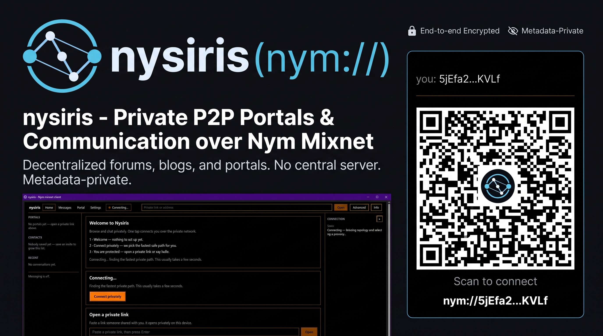
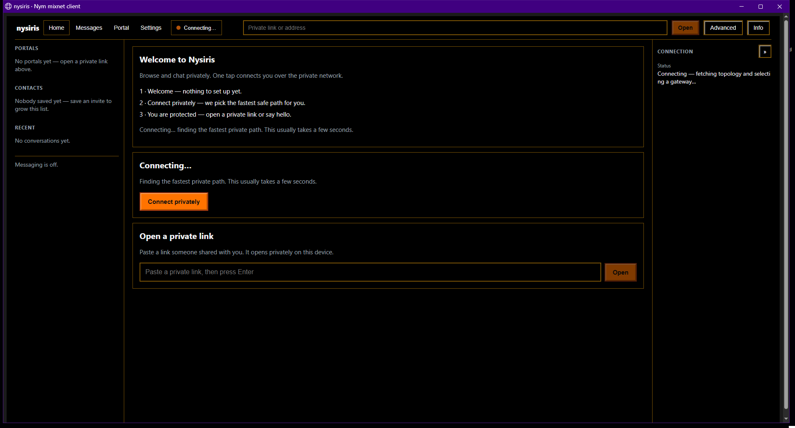
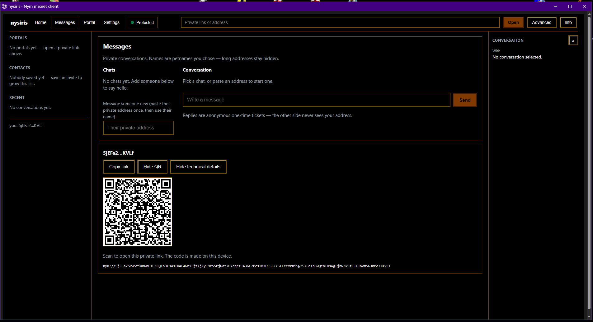
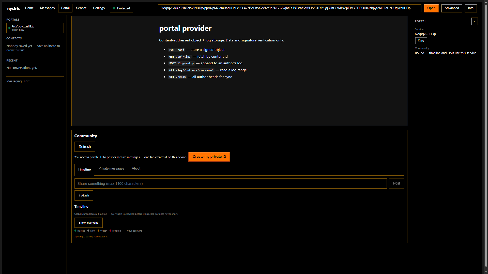

# Nysiris

> ⚠️ **Experimental / pre-audit.** This repository is under active development
> and has **not** had an independent security audit. The Sphinx core in
> `crates/` is a reference implementation, never production crypto. Do not
> rely on it for high-stakes anonymity yet — see the
> [threat model](#threat-model-short-version) and
> [`docs/05-security.md`](docs/05-security.md) for what is and isn't protected.

Nysiris is a private browser for the **Nym mixnet**: a cross-platform client
(web / PWA / Android / desktop) plus the pieces to **host your own service** on
the mixnet. It gives you a calm, everyday UI — private links, a community
timeline with end-to-end encrypted DMs, and a leak-guarded tunnel — while the
mixnet hides **who talks to whom and when** from network observers. Formerly
`fly-protocol`; renamed, nothing else moved.

[](https://github.com/odelyzid/Nysiris/actions)
[](LICENSE)
[](https://nysiris.tribewarez.com/)
[](https://github.com/odelyzid/Nysiris/wiki)

🌐 **[nysiris.tribewarez.com](https://nysiris.tribewarez.com/)** · 📖 **[Documentation wiki](https://github.com/odelyzid/Nysiris/wiki)**

> **Status:** foundations, hosting, browser client, social/DMs, trust
> indicators, desktop packaging, and security analysis complete, with the
> documented controls enforced in code and tests.
> * Reference Rust workspace: **100 tests pass** (the soak test is ignored by
>   default).
> * Browser PWA + social logic: **191 `node --test` tests pass** (0 failures).
> * Service hosting: runnable providers + hybrid compose + gateway assets.
> * Build system: `./build.sh` for Rust / web / Android / services / desktop /
>   Windows / check, plus CI.
> * The `services/*` builds depend on Nym's own packages and are not compiled by
>   the fast `./build.sh check` loop.

## What works vs what is experimental

| Area | State |
|---|---|
| PWA: tunnel, leak guard, Nym-address messaging, `fetchNym` (+ parallel tagged requests) | Works (mainnet-verified delivery + SURB reply) |
| Community timeline, threads, E2E DMs, trust dots, petnames, invites, encrypted attachments | Works against a `nysiris-social` provider you run |
| Providers, hybrid bridge, portal store | Works; you operate them (see `services/`) |
| Linux `.deb`, Windows zip | Works; built by CI on every release tag |
| Android (TWA/Capacitor), MV3 extension | Scaffolds — installable, not yet hardened |
| `sphinx-core` crypto | Reference/educational only — never use in production |

## Quick start

Prerequisites: a stable Rust toolchain and Node 24 (the version CI uses for the
browser client and its type-stripping tests).

```bash
git clone https://github.com/odelyzid/Nysiris.git
cd Nysiris

./build.sh check     # toolchain sanity: fmt + clippy + 100 Rust + 191 web tests
./build.sh web       # build the browser PWA into web/dist
```

Run the client from the built bundle (serve `web/dist` with any static file
server) or with the dev server:

```bash
cd web && npm install && npm run dev
```

Hosting a service on the mixnet (echo / portal / social providers, the hybrid
bridge, and a self-hosted entry gateway) is covered in
[`docs/04-hosting-services.md`](docs/04-hosting-services.md) and the per-service
READMEs under `services/`:

```bash
./build.sh services            # build + test every standalone provider
./build.sh services social     # or just one
```

The live-network proof — real delivery and a SURB reply against mainnet — is:

```bash
./build.sh acceptance
```

## Threat model (short version)

Mixing + cover traffic hide **who talks to whom and when** from network
observers (L1/L3), and services never learn client addresses (SURB replies).
It does **not** protect against a compromised endpoint, a malicious service
you choose to use, or timing correlation when cover traffic is thin. Full
analysis: [`docs/05-security.md`](docs/05-security.md).

## Read in this order

Prefer a rendered site? These docs are mirrored to the
[GitHub Wiki](https://github.com/odelyzid/Nysiris/wiki); the project site is
[nysiris.tribewarez.com](https://nysiris.tribewarez.com/).

1. [`docs/01-architecture.md`](docs/01-architecture.md) — system overview, two
   traffic modes, trust boundaries, browser/WASM constraints.
2. [`docs/02-addressing-and-routing.md`](docs/02-addressing-and-routing.md) —
   how "DNS" is replaced by cryptographic identities, the exact Sphinx
   construction (`alpha`, `beta`, `gamma`, `delta`), SURBs, diagrams.
3. [`docs/04-hosting-services.md`](docs/04-hosting-services.md) — pure mixnet
   provider, hybrid clearnet+mixnet, self-hosted gateway, with configs.
4. [`docs/03-browser-client.md`](docs/03-browser-client.md) — cross-platform
   client design, leak guard, CSP, Android packaging.
5. [`docs/05-security.md`](docs/05-security.md) — threat model (L1/L2/L3L/L3G,
   V1/V2/V3, P1/P2), tagging, timing, SURB hoarding/reuse, exit trust.
6. [`docs/08-hidden-services.md`](docs/08-hidden-services.md) — hidden-service
   abstraction: `nym://` URIs, envelopes, server dispatch, petnames, chunking.
7. [`docs/09-social.md`](docs/09-social.md) — nysiris-social: metadata-minimal
   microblog + E2E DMs, SQLite security, signature/E2E specs, operations.
8. [`docs/07-desktop-linux.md`](docs/07-desktop-linux.md) — Linux Mint / Debian
   desktop packaging (`.deb`, Electron, Tauri, Flatpak) and engine compatibility.
9. [`docs/06-roadmap.md`](docs/06-roadmap.md) — phased plan with acceptance
   criteria.

## Build & verify

One entry point for everything:

```bash
./build.sh check              # fmt + clippy(-D warnings) + all tests + docs
./build.sh rust --release     # optimized workspace build
./build.sh rust --target aarch64-unknown-linux-gnu
./build.sh wasm               # sphinx-core -> wasm32 (optional)
./build.sh web                # install deps + build the PWA
./build.sh android            # TWA (Bubblewrap) or Capacitor
./build.sh services           # standalone Nym service crates
./build.sh soak               # heavy parser/route soak (release)
./build.sh acceptance         # live-network delivery + SURB reply (needs Nym toolchain)
./build.sh desktop            # Linux .deb (system Chromium); --electron for Electron
./build.sh windows            # Windows zip via MSYS2/MinGW or MSVC (see docs/12-windows.md)
./build.sh all                # rust + check + web
./build.sh clean [--deep]
./build.sh --help
```

Releases are cut from tags: `./build.sh bump <version>`, commit `VERSION`,
`git push origin v<version>` — CI builds the `.deb` + Windows zip and
publishes them with checksums (`.github/workflows/release.yml`).

`./build.sh check` runs **100 Rust tests** and **191 web unit tests** with zero
clippy warnings, validates the JSON manifests, and checks every relative link in
the docs. It runs offline (no `npm install`). CI runs it on every push/PR.

- **Fuzzing**: deterministic mutation fuzzing runs inside `check`; optional
  coverage-guided fuzzing is in `crates/sphinx-core/fuzz/` (nightly + cargo-fuzz).
- **Soak**: `./build.sh soak` runs 5,000 randomised routes/messages in release.
- **Live network**: `./build.sh acceptance` sends to self and replies over SURBs
  against mainnet. See `services/acceptance/README.md` for toolchain setup.

## What is implemented

| Path | What | Verification |
|---|---|---|
| `crates/sphinx-core/` | Reference Sphinx: header/blinding/filler/MAC/Lioness/SURB/address | `cargo test -p sphinx-core` |
| `crates/sphinx-core/src/enforcement.rs` | Route policy, SURB single-use/expiry, reply budget, exit rotation, cover-traffic guardrail | 12 tests |
| `crates/bridge-guard/` | Open-proxy guards for the mixnet↔HTTP bridge | 8 tests |
| `crates/nym-hidden-service/` | Hidden-service abstraction: URIs, envelopes, dispatch, petnames, chunking | 13 tests |
| `crates/portal-data/` | Portal data model: content-addressed objects, append-only logs, LWW-map | 4 tests |
| `crates/portal-replication/` | Sync core: heads, want-lists, verified atomic apply | 12 tests |
| `crates/portal-reputation/` | PoW, local reputation scores, provider rate limits | 5 tests |
| `crates/provider-runtime/` | Shared hidden-service runtime: transport seam, request loop, PoW + rate guards, route plumbing | 15 tests |
| `crates/social-format/` | Byte-exact social wire format: signed envelope framing, attachment binding, size limits, PoW preimages | 13 tests |
| `crates/sphinx-core/tests/fuzz_parser.rs` | Deterministic mutation fuzzing of all parsers | 6 tests |
| `crates/sphinx-core/tests/soak.rs` | Randomised route/message soak (release) | `./build.sh soak` |
| `crates/sphinx-core/fuzz/` | Coverage-guided fuzzing targets (nightly) | `cargo +nightly fuzz run parse_packet` |
| `services/echo-provider/` | Pure-mixnet service provider (`nym-sdk` 1.21.x messaging) | Written against documented API; build in place |
| `services/acceptance/` | Live-network delivery + SURB reply harness | **Passed on mainnet**: delivery ≈7.6 s, SURB reply ≈7.1 s |
| `services/hybrid-bridge/` | Nym↔HTTP bridge + Caddy + Docker Compose, using `bridge-guard` | `docker compose config` + guard tests |
| `services/social/` | nysiris-social: signed-post microblog + E2E DM dead-drop (SQLite, `HiddenService`); encrypted attachments (content-addressed blobs, chunked + parallel upload); PoW + rate-limit hooks (`SOCIAL_POW_BITS`, `SOCIAL_RATE_PER_DAY`) | 24 tests + `web/src/adapters/driving/social/` timeline UI |
| `services/portal-provider/` | Portal object/log store; PoW + rate-limit hooks (`PORTAL_POW_BITS`, `PORTAL_RATE_PER_DAY`) | 5 tests |
| `services/gateway/` | `nym-node` entry-gateway config, systemd, bonding notes | Templates + operator steps |
| `web/` | React PWA: tunnel, `mixFetch`, Nym-address messaging, `fetchNym`, nysiris-social timeline, leak guard, runtime enforcement | 191 `node --test` tests + `npm run build` |
| `android/` | TWA/Capacitor guidance, manifest, network security config | Templates |
| `desktop/launcher/` | std-only Linux launcher: loopback static server + Chromium app window | 6 tests |
| `desktop/debian/` | `.deb` packaging (control, postinst, `.desktop`, icon) | Built + inspected; `./build.sh desktop` |
| `desktop/electron/` | Electron alternative (bundled Chromium) | Scaffold |
| `extension/` | MV3 desktop scaffold | Load unpacked after bundling |
| `build.sh` + `scripts/` | Rust / web / android / services / check build system | `check` runs offline |
| `.github/workflows/ci.yml` | CI | Runs `./build.sh check` |

## Reference core

`crates/sphinx-core` is a faithful, tested mirror of Nym's `sphinx-packet`:

* X25519 key schedule + per-hop blinding, HKDF-SHA256 → 288 bytes
* AES-128-CTR header onion with the Sphinx filler
* HMAC-SHA256 (16-byte) header integrity
* Lioness (BLAKE2b + ChaCha) payload onion
* SURBs, Nym address parsing (`<id>.<enc>@<gw>`), path selection

```bash
./build.sh check
```

It produces a **regular packet of exactly 2413 bytes** (348 header + 2065
payload), matching the production network.

> ⚠️ **Not production crypto.** Real software must use Nym's audited packages:
> `@nymproject/mix-tunnel` / `mixFetch` / `sdk-full-fat` (browser),
> `nym-sdk` / `nym-sphinx` / `sphinx-packet` (Rust), `nym-client` /
> `nym-socks5-client` (standalone). This crate is for education, audit and test
> vectors.

## Releasing / versioning

`./VERSION` is the single source of truth for the application version. It drives
the `.deb` and Electron packages and is kept in sync with `web/package.json`
and `desktop/electron/package.json`.

```bash
./build.sh bump patch        # 0.1.6 -> 0.1.7
./build.sh bump minor        # 0.1.6 -> 0.2.0
./build.sh bump major        # 0.1.6 -> 1.0.0
./build.sh bump 1.2.3        # set an explicit version

./build.sh desktop                       # -> dist/nysiris_<version>_amd64.deb
./build.sh desktop --electron            # -> Electron .deb + AppImage
./build.sh web && ./build.sh android     # PWA / Android
./build.sh check                         # verify
```

`--app-version X.Y.Z` overrides the version for one build without changing
`./VERSION`.

> The Rust crates under `crates/` carry their own independent versions
> (`0.1.0`); `./VERSION` is the **application / package** version.

## Upgrading dependencies

| Component | Where | How |
|---|---|---|
| Rust toolchain | system | `rustup update` |
| Rust crates | `crates/*/Cargo.toml` | edit the version, then `cargo update` |
| Nym SDK (services) | `services/*/Cargo.toml` | `cargo search nym-sdk`, raise the version, rebuild |
| Browser Nym SDK | `web/package.json` | `npm view @nymproject/mix-fetch version` (and `sdk-full-fat`), then `npm install` |
| Electron | `desktop/electron/package.json` | `npm install electron@latest electron-builder@latest --save-dev` |

`nym-sdk`, `nym-bin-common` and `nym-sphinx` are versioned **independently** on
crates.io (as of this writing `nym-sdk` 1.21.6 while `nym-bin-common` is
1.22.0), so raise them individually and re-read the API when you do — the
messaging API has changed between releases.

After any upgrade: `./build.sh check`, then `./build.sh acceptance` for anything
touching the network path.

## Layout

```
build.sh                 one entry point: rust | web | android | services | check | all | clean
scripts/                 modular build commands + doc/JSON validators
.github/workflows/       CI + release + wiki publishing
.github/                 community health: SECURITY, CONTRIBUTING, CODE_OF_CONDUCT, CHANGELOG
.agents/AGENTS.md        guidance for AI coding agents
crates/sphinx-core/      reference Sphinx + enforcement controls (workspace)
crates/bridge-guard/     open-proxy guards (workspace)
crates/nym-hidden-service/  hidden-service abstraction: URIs, envelopes, dispatch, petnames (workspace)
crates/portal-data/      portal objects + append-only logs (workspace)
crates/portal-replication/  sync core: heads, want-lists, verified atomic apply (workspace)
crates/portal-reputation/   PoW + local reputation + rate limits (workspace)
crates/provider-runtime/   shared hidden-service runtime (workspace)
crates/social-format/      byte-exact social wire format (workspace)
docs/                    architecture, addressing/routing, hosting, client, security, desktop, hidden-services, roadmap
services/                echo-provider, hybrid-bridge, portal-provider, social, acceptance (standalone) + gateway ops
web/                     React PWA client (TypeScript)
  src/domain/              pure rules/types (no React, no fetch, no storage)
  src/application/        use-cases / orchestration over the ports
  src/adapters/driving/   React components + UI hooks (shell / portal / social / shared)
  src/adapters/driven/    keystore, network, blob + portal-sync I/O
  src/shared/             cross-cutting UI helpers
android/                 Android packaging manifest + guidance
desktop/                 launcher, .deb + Windows packaging, Electron alternative
extension/               MV3 desktop scaffold
```

## Screenshots



### Tabs

| Home | Messages |
|---|---|
|  |  |



These contain no real addresses, contacts, or messages. Serve `web/dist` (or a
release package) to click through it yourself — more honest screenshots welcome.

## Community & license

- Site: [nysiris.tribewarez.com](https://nysiris.tribewarez.com/).
- Docs: [`docs/`](docs) · [GitHub Wiki](https://github.com/odelyzid/Nysiris/wiki).
- Contributing: [`.github/CONTRIBUTING.md`](.github/CONTRIBUTING.md) (start with `.agents/AGENTS.md`).
- Security reports: [`.github/SECURITY.md`](.github/SECURITY.md) — private advisories only.
- Conduct: [`.github/CODE_OF_CONDUCT.md`](.github/CODE_OF_CONDUCT.md).
- Changes: [`.github/CHANGELOG.md`](.github/CHANGELOG.md).
- License: [Apache-2.0](LICENSE) © 2026 odelyzid (tribewarez).
