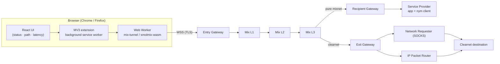
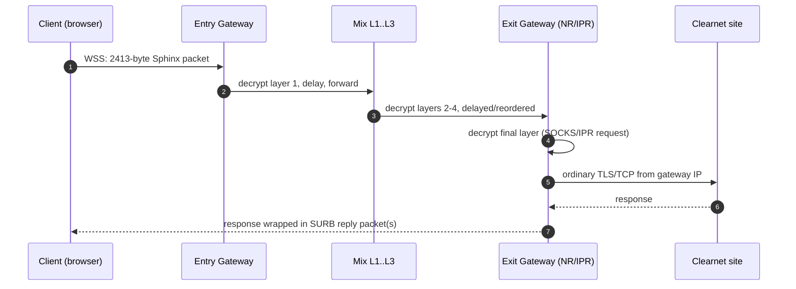
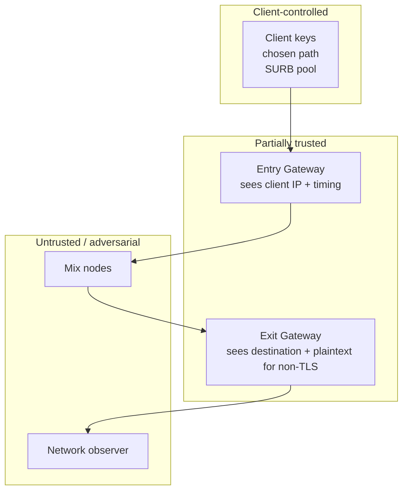

# 1. High-Level Architecture

> Scope: this document describes the whole system. Section 2 covers the browser
> client, section 3 hosting a service, section 4 addressing/routing, section 5
> security, and section 6 the roadmap. This file and
> [`02-addressing-and-routing.md`](02-addressing-and-routing.md) are the
> foundation the rest builds on.

---

## 1.1 What "Nym" actually is (and is not)

Nym is a **packet-level mixnet**, not a VPN and not Tor. It protects *metadata*
(who talks to whom, when, how often) by moving every message through a
sequence of nodes that each delay and reorder traffic. Two properties drive
every design decision below:

1. **Uniform packets.** Every regular Sphinx packet is exactly **2413 bytes**
   (348-byte header + 17-byte payload overhead + 2048-byte plaintext). If size
   varied, an observer could fingerprint routes.
2. **The client knows the whole path; no node does.** Only the sender chooses
   Entry Gateway → Mix L1 → L2 → L3 → destination. Each hop learns only its
   immediate predecessor and successor.

The component roles in the current (2025–2026) network:

| Role | Runs as | Job |
|------|---------|-----|
| **Mix Node** | `nym-node --mode mixnode` | Decrypt one Sphinx layer, random delay, forward. Three layers in production. |
| **Entry Gateway** | `nym-node --mode entry-gateway` | Public WSS endpoint. Clients connect here; stores messages for offline clients. First Sphinx hop. |
| **Exit Gateway** | `nym-node --mode exit-gateway` | Last Sphinx hop for clearnet traffic. Runs the **Network Requester** (SOCKS4/4a/5) and **IP Packet Router** (raw IP). |
| **Service Provider** | *your app* + embedded client | A fourth participant, not infrastructure. Reachable only by Nym address; replies via SURBs. |
| **Nyx blockchain / nym-api** | separate | On-chain topology registry + signed epoch topology the client fetches. |

> **Critical production rule.** Do not write your own Sphinx or curve code for
> real users. Use Nym's own software:
> - Browser: `@nymproject/mix-tunnel`, `@nymproject/mix-fetch`,
>   `@nymproject/mix-dns`, `@nymproject/mix-websocket`.
> - Rust services/apps: `nym-sdk`, `nym-sphinx`, `sphinx-packet`.
> - Local daemon / non-browser apps: `nym-client`, `nym-socks5-client`.
>
> This repo's `crates/sphinx-core` is a **reference implementation** for
> education, audit and test vectors. It is not a substitute for audited code.

---

## 1.2 System architecture

### Logical view



### ASCII view (matches Nym's own docs)

```
                         ┌─► mix L1 ─┐  mix L2   mix L3
client ──WSS──► Entry ───┤           ├──► ... ────┴─► destination
                Gateway  └─► mix L1 ─┘                  │
                                                        ├─ pure mixnet: recipient's Gateway → Service
                                                        └─ clearnet:    Exit Gateway → NR / IPR → site
```

### Sphinx hop count

The Sphinx header supports `MAX_PATH_LENGTH = 5`, which is exactly:

```
[ Entry Gateway ] → [ Mix L1 ] → [ Mix L2 ] → [ Mix L3 ] → [ Destination Gateway ]
        1                 2            3            4                 5
```

* **Pure mixnet** — hop 5 is the recipient's Gateway; the Sphinx *destination*
  address inside the final layer selects the client/service identity.
* **Clearnet** — hop 5 is an **Exit Gateway** running the Network Requester or
  IPR, which makes the clearnet connection. The destination sees the Exit
  Gateway's IP, never the client's.

The three mix layers are the anonymity core; the entry/exit gateways are the
transport and policy boundaries.

---

## 1.3 Two traffic modes

| | **Pure mixnet (end-to-end)** | **Clearnet (proxy mode)** |
|---|---|---|
| Final hop | Recipient's Gateway | Exit Gateway |
| Destination | Nym address (`id.enc@gw`) | `host:port` on the public internet |
| Content encryption | Sphinx-only; add app-layer crypto for confidentiality | TLS runs end-to-end to the site (mixnet only tunnels it) |
| Who sees the destination | Recipient | Exit Gateway sees destination, not sender |
| Exit policy | None | Exit Gateway's policy (ports/hosts allow-list) |
| Use for | Private services, messaging, RPC, wallets | Browsing, fetching public APIs |



> For conversation-style clearnet traffic (HTTP over TCP), the browser stack
> builds **SOCKS5-shaped** requests and a userspace TCP/IP stack (`smoltcp`)
> runs inside WASM; TLS (`rustls`) terminates at the destination. See §1.5.

---

## 1.4 Repository layout (this project)

```
nysiris/
├── Cargo.toml                     workspace
├── crates/
│   └── sphinx-core/               reference Sphinx (builds, tested, not for prod)
├── docs/
│   ├── 01-architecture.md         ← this file
│   ├── 02-addressing-and-routing.md
│   └── 06-roadmap.md
├── web/                           (planned) React UI
├── extension/                     (planned) MV3 browser extension
├── services/                      (planned) service-provider examples + Docker
└── workers/                       (planned) mix-tunnel wrapper TypeScript
```

`crates/sphinx-core` mirrors `sphinx-packet` v0.6.x exactly where it matters:

| Concern | Implementation | Test |
|---|---|---|
| `alpha` blinding chain | X25519 via `x25519-dalek` | 3-hop route test |
| `beta` routing onion | AES-128-CTR + Sphinx filler | 3-hop route test |
| `gamma` | HMAC-SHA256 truncated to 16 B | tamper test |
| `delta` | Lioness (BLAKE2b + ChaCha) | plaintext recovery test |
| SURB | header + per-hop payload keys | SURB reply test |
| Address | `<id>.<enc>@<gw>` base58 | round-trip test |

Run it: `cargo test -p sphinx-core`

---

## 1.5 Browser reality (WASM constraints)

A browser cannot open raw sockets or a SOCKS listener, so the production Nym
design is:

```
Main thread (React app)
  mix-fetch / mix-dns / mix-websocket  (thin facades)
        │  Comlink RPC over postMessage
        ▼
Web Worker (one per page)
  smolmix-wasm
    ├─ IPR client  → WSS to Entry Gateway
    ├─ smoltcp     → userspace TCP/IP (no raw sockets in browsers)
    └─ rustls      → TLS terminated inside the WASM (Mozilla CA bundle baked in)
        ▼
  Nym mixnet: entry → 3 mix layers → exit (IPR/NR) → internet
```

Consequences you must design around:

* **One tunnel per page.** `setupMixTunnel` is one-shot; after
  `disconnectMixTunnel` the page must reload. Memoise a single promise.
* **Worker + CSP.** You need `worker-src 'self' blob:`; the worker is started
  from an object URL. `connect-src` must include `wss:` and the bootstrap host
  `https://validator.nymtech.net` (plain HTTPS, before any mixnet exists).
* **Bundle size.** The WASM worker chunk is several MB; lazy-load it.
* **Not everything can be routed.** Cross-origin iframes, vendor SDKs,
  `sendBeacon`, `EventSource`, ``/`<script>` prefetches and third-party
  `WebSocket`s bypass your code. Drop those integrations or proxy them.
* **Leak guard.** Wrap `fetch` and `XHR.open` to detect direct requests to
  routed hosts, and fail closed in development.

Optional escape hatch for desktop/other apps: run a local `nym-socks5-client`
and point the browser/OS at `127.0.0.1:1080`. Same mixnet, no WASM limits.

---

## 1.6 Trust boundaries



* **Entry Gateway** knows the client's IP but not the destination. That is the
  one node that can link you to *the fact you are using Nym*.
* **Exit Gateway** knows the destination but not the sender. Clearnet traffic
  is only as private as its own encryption past the exit.
* **Mix nodes** are assumed adversarial; layered encryption + independent
  delays are what break correlation.
* **Client** is the only party that knows the full route.

---

## 1.7 What this repo delivers, phase by phase

See [`06-roadmap.md`](06-roadmap.md) for acceptance criteria. Summary:

1. **Foundations** — architecture + addressing/routing + reference Sphinx core ✅
2. **Browser client** — `mix-tunnel` wrapper, React UI, MV3 extension, leak guard
3. **Service hosting** — pure-mixnet provider, hybrid nginx/Caddy, self-hosted gateway
4. **Hardening** — security analysis, cover traffic tuning, observability

Next: **[`02-addressing-and-routing.md`](02-addressing-and-routing.md)** for
how "DNS" is replaced by cryptographic identities and a signed topology.
