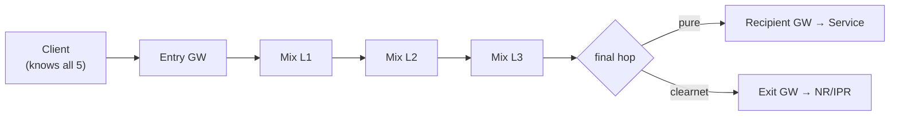
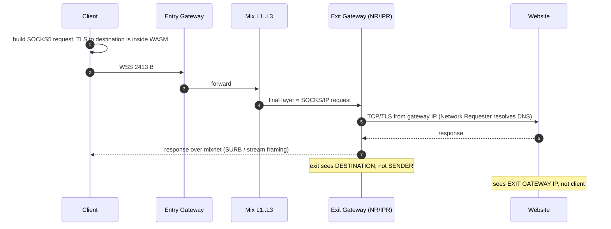

# 2. Addressing & Routing Deep-Dive: how "DNS" works in Sphinx/Nym

> Section [4] of the original brief. This is the counterpart to
> [`01-architecture.md`](01-architecture.md). Every byte layout and formula
> below is implemented and tested in `crates/sphinx-core`.

---

## 2.1 There is no DNS — by design

Traditional DNS is a **global, queryable, enumerable directory**: anyone can ask
"what is the IP of `example.com`?" and, more importantly, *observe* that the
question was asked. A mixnet cannot use that model for two reasons:

1. **Enumeration.** If Nym addresses lived in a public directory, an adversary
   could enumerate every service and correlate them with clearnet identities.
2. **Metadata.** A resolution lookup is itself a linkable event ("this client is
   about to talk to this service").

So Nym separates **naming** from **routing**:

| Question | Traditional Internet | Nym |
|---|---|---|
| Where is the service? | DNS → IP address | Topology (Nyx registry) → set of node keys; service addressed by **cryptographic identity** |
| What is the service called? | DNS name | A **Nym address**: `<identity>.<encryption>@<gateway>` |
| How do I discover a name? | DNS query | **Out of band.** No discovery system exists, deliberately. |
| How is routing decided? | BGP / IP | The **sender** chooses the whole Sphinx path. |
| How do I resolve a clearnet hostname privately? | local resolver leaks | `mixDNS` / Network Requester SOCKS resolves it *at the exit* |

> **Key sentence.** A Nym address *is* the routing instruction. There is no
> second lookup. "Resolution" is just parsing three public keys out of a string
> you already have.

`mix-dns` exists, but it solves the *other* problem: resolving **clearnet**
DNS records through the mixnet so your ISP does not see which sites you visit.
It is not a naming system for Nym services.

---

## 2.2 The Nym address

```
<user-identity-key>.<user-encryption-key>@<gateway-identity-key>
```

Three base58-encoded 32-byte keys:

| Component | Meaning | Role |
|---|---|---|
| **identity key** | Ed25519 public key of the client/service | Routing/mailbox identity inside its gateway |
| **encryption key** | Curve25519 public key | Becomes the Sphinx **destination address**; only the holder of the private key decrypts the final Sphinx layer |
| **gateway identity key** | Ed25519 public key of the Gateway | Names the Gateway that stores messages while the client is offline |

Example (from Nym's docs):

```
DguTcdkWWtDyUFLvQxRdcA8qZhardhE1ZXy1YCC7Zfmq.Dxreouj5RhQqMb3ZaAxgXFdGkmfbDKwk457FdeHGKmQQ@4kjgWmFU1tcGAZYRZR57yFuVAexjLbJ5M7jvo3X5Hkcf
```

### Operational consequences

* **The gateway is baked into the address.** If that Gateway disappears, every
  copy of the address stops working. Persistent storage keeps *your* keys; it
  cannot keep someone else's Gateway online.
* **For a stable address, run your own Gateway** and register the service to it.
  A Gateway you run is still public — all gateways serve all users.
* **For an ephemeral identity, generate fresh keys per session.** A new address
  every run (the default in Nym examples) is a feature, not a bug.
* The address reveals *which gateway* you use and your public keys. It reveals
  nothing about your IP or private keys, and many clients share a gateway.

`crates/sphinx-core/src/address.rs` implements parse/encode and derives the
Sphinx destination:

```rust
let addr = NymAddress::parse("id.enc@gw")?;
let destination = addr.destination_address(); // = the encryption key
// route ends at addr.gateway_identity()
```

### Human-readable names

There is no canonical `.nym` TLD. Options, in increasing order of risk:

1. **Ship the address in your client config** (recommended). Distribution is
   out of band: QR code, a signed release, an on-chain ENS record, etc.
2. **ENS over the mixnet** — Nym publishes a demo resolving ENS records through
   the mixnet. This gives human names without a central directory, at the cost
   of depending on ENS.
3. **Do not invent a public naming service.** Any "Nym DNS" that answers
   queries for arbitrary addresses destroys the unlinkability of first contact.

---

## 2.3 Topology: the replacement for DNS + BGP

The set of nodes eligible to route traffic is stored **on the Nyx blockchain**
and published, per **epoch**, as a signed topology document served by `nym-api`.

```
Nyx blockchain (on-chain registration, bonding, epochs)
        │  epoch N topology
        ▼
   nym-api  ──signed JSON──►  client
        │
        └─ per node: identity key, Sphinx (Curve25519) key, routing address,
           layer (1/2/3), gateway role, performance, version
```

A client performs exactly one ordinary HTTPS request to bootstrap:
`https://validator.nymtech.net` (mainnet). After that, all traffic can go
through the mixnet. This is why CSP must allow that host, and why it is the only
cleartext dependency.

Clients must:

* **Pin the network's signing key** so a compromised API cannot inject nodes.
* **Re-fetch per epoch** (mainnet epochs are ~1 hour) because node keys rotate.
* **Filter** nodes by version, liveness/performance, and required layer.

`crates/sphinx-core/src/path.rs` models the post-verification snapshot:

```rust
pub struct MixnetTopology {
    pub entry_gateways: Vec<Node>,
    pub mix_layers: [Vec<Node>; 3],   // three production layers
    pub exit_gateways: Vec<Node>,
}
```

---

## 2.4 Path selection

Uniform random selection, one node per layer, is sufficient because no single
node sees more than its neighbours:

```
route = [
    random(entry_gateways),
    random(mix_layers[0]),
    random(mix_layers[1]),
    random(mix_layers[2]),
    random(exit_gateways)        // clearnet
    // or the recipient's gateway // pure mixnet
]
```



Hard rules:
* Never reuse a node within a path.
* Prefer diversity of operator/ASN where the topology exposes it.
* Respect `MAX_PATH_LENGTH = 5`.
* Re-select per message or per short session; long-lived fixed paths are
  fingerprintable.

---

## 2.5 The exact send algorithm

This is the client-side procedure, step by step. Each step maps to code in
`crates/sphinx-core`.

### Step 0 — Have the address

```
gw_id.enc_key@gateway_id          →  parse →  NymAddress
```

### Step 1 — Resolve a human name (optional)

Out of band → Nym address. If none, skip.

### Step 2 — Obtain the topology

Fetch the signed epoch topology (once per epoch). Verify signature + pin.

### Step 3 — Select the path

`MixnetTopology::select_path(...)` → `Vec<Node>` of up to 5 hops.
For clearnet, the last hop is an Exit Gateway; for a service, the service's
Gateway.

### Step 4 — Build key material (the blinding chain)

For an ephemeral secret `r` (`alpha_0 = g^r`), for each hop `i` with public key
`y_i`:

```
acc_i   = X25519(b_{i-1}, ... X25519(b_1, X25519(r, y_i)))   # accumulate
ess_i   = HKDF-SHA256(acc_i)                                  # 288 bytes
b_i     = ess_i.blinding_factor                               # Curve25519 scalar
```

The 288-byte expansion is split as (order matters, it is a compatibility
contract):

```
[ stream_cipher_key 16 ][ mac_key 16 ][ payload_key 192 ][ blinding_factor 32 ][ replay_tag 32 ]
```

The transmitted `alpha` is blinded at every hop:
`alpha_{i+1} = X25519(b_i, alpha_i)`. A node computes the identical
`acc_i` as `X25519(node_secret_i, alpha_i)`, so sender and node agree on the
shared secret while each hop sees a **different, unlinkable** `alpha`.

### Step 5 — Build the header (`alpha`, `beta`, `gamma`)

From the inside out:

* **Final hop plaintext** (length `300 − 60·(r−1)`):
  `FINAL_HOP | version(3) | destination(32) | identifier(16) | random_pad`
* **Forward hop plaintext** (always 300 B):
  `FORWARD_HOP | version(3) | next_addr(32) | delay(8) | next_mac(16) | next_beta[0..240]`
* Each layer is XORed with an **AES-128-CTR** keystream derived from that hop's
  `stream_cipher_key` (zero IV).
* `gamma_i = HMAC-SHA256(mac_key_i, beta_i)[0..16]`.
* The **filler** (built from all but the last hop's keystreams) is appended to
  the final layer so that after every hop shifts the header left by 60 bytes and
  appends 60 bytes of its own keystream, the tail stays valid.

Result: `SphinxHeader { alpha(32) | gamma(16) | beta(300) }` = **348 bytes**.

### Step 6 — Build the payload (`delta`)

```
zeros(16) | message | 0x01 | zeros(...)      → 2065-byte buffer
```

then wrap in one **Lioness** (BLAKE2b + ChaCha) layer per hop, applied in
reverse so the first hop's key is outermost. Wide-block encryption means any
tampering randomises the whole payload and the padding delimiter cannot be
attacked surgically.

### Step 7 — Send

Total packet = 348 + 2065 = **2413 bytes**, sent over the persistent **WSS**
connection to the Entry Gateway. The gateway forwards to hop 2; it does not
choose the route.

### Step 8 — Per-hop processing

Each hop receives `(alpha, beta, gamma, delta)`:

1. `ess = HKDF(X25519(node_secret, alpha))`.
2. Verify `gamma == HMAC(mac_key, beta)[0..16]`; drop on mismatch.
3. Decrypt `beta` with the AES-CTR keystream (+60 zero bytes).
4. If `FORWARD_HOP`: read next address + delay, blind `alpha`, set the new
   `beta`/`gamma`, unwrap one payload layer, wait `delay`, forward.
5. If `FINAL_HOP`: read destination + identifier, unwrap the final payload
   layer, recover plaintext, deliver to the local client (or the Exit
   Gateway's NR/IPR runs the clearnet request).

### Step 9 — Reply via SURB

The sender cannot be replied to directly without revealing its address, so:

1. Before sending, the client creates one or more **SURBs**: a pre-built Sphinx
   header for a return route, plus the vector of per-hop payload keys.
2. The SURB is included *with* the request (its route is encrypted and
   unreadable to the recipient).
3. The recipient calls `surb.reply(msg)` → a normal 2413-byte packet, and sends
   it to the SURB's **first hop**.
4. It traverses the return route and only the creator can decrypt it.

A SURB is **single-use**; validity is tied to key rotation (≈24 epochs, ~25 h).
For larger replies the recipient uses one SURB to request more
(**SURB replenishment**), and `sender_tag`s let it group SURBs from many
conversations without learning identities.

---

## 2.6 Byte-level packet map

```
┌────────────────────────────── 2413 bytes ──────────────────────────────┐
│ HEADER 348                                                             │
│  ┌ alpha 32 ┐┌ gamma 16 ┐┌ beta 300 ────────────────────────────────┐  │
│  │ g^r      ││ HMAC     ││ AES-128-CTR(routing onion + filler)       │  │
│  └──────────┘└──────────┘└──────────────────────────────────────────┘  │
├────────────────────────── PAYLOAD 2065 ────────────────────────────────┤
│  ┌ overhead 17 ┐┌ plaintext 2048 ───────────────────────────────────┐   │
│  │ 16×00 | 0x01 ││ message ... padding (Lioness-encrypted per hop)   │   │
│  └─────────────┘└───────────────────────────────────────────────────┘   │
└────────────────────────────────────────────────────────────────────────┘
```

Routing-block sizes (why the numbers are what they are):

| Block | Bytes | Composition |
|---|---|---|
| Forward meta | 44 | addr 32 + flag 1 + delay 8 + version 3 |
| Final meta | 52 | destination 32 + identifier 16 + flag 1 + version 3 |
| `(meta + MAC)` per hop | 60 | 44 + 16 |
| `beta` = 60 × 5 | 300 | `ENCRYPTED_ROUTING_INFO_SIZE` |
| Truncated next-layer | 240 | `beta − 60` |
| Keystream per hop | 360 | 60 × (5 + 1) |

---

## 2.7 Sequence diagrams

### A. Client → Service (pure mixnet)

```mermaid
sequenceDiagram
  autonumber
  participant C as Client
  participant EG as Entry Gateway
  participant M as Mix L1..L3
  participant SG as Service Gateway
  participant S as Service Provider

  C->>C: parse Nym address, pick 5-hop path
  C->>C: build Sphinx packet + embed N SURBs
  C->>EG: WSS 2413 B
  EG->>M: layer 1 removed, delayed
  M->>SG: layers 2-4 removed, reordered
  SG->>S: final layer: destination + payload
  S->>S: surb.reply(response)
  SG->>M: return packet (SURB header)
  M->>EG: reordered
  EG->>C: reply arrives; only client decrypts
```

### B. Client → Exit Gateway → clearnet



### C. SURB (anonymous reply)

```
Client                                   Service
  │ create_surb(return_route, self)        │
  │  → header + payload_keys               │
  │──────── request + SURB ───────────────▶│
  │                                        │ reply = payload_keys layered msg
  │                                        │ send to SURB.first_hop
  │◀────────── return route (mixes) ───────│
  │ decrypt with own secret at final hop   │  (never learns client address)
```

---

## 2.8 Mapping Nym Sphinx ⇄ the academic paper

| Paper | Nym implementation | Notes |
|---|---|---|
| Group `G`, generators | **Curve25519 / X25519** | No pairings. Nym does not use the bilinear groups of the 2009 paper. |
| `alpha` | ephemeral X25519 point, blinded per hop | `alpha_{i+1} = b_i · alpha_i` |
| `beta` | encrypted routing info (300 B) | AES-128-CTR keystream + filler |
| `gamma` | truncated HMAC-SHA256 (16 B) | one MAC per layer |
| `delta` | Lioness wide-block payload | BLAKE2b + ChaCha, 192-byte key |
| `h_rho` | stream cipher key | HKDF-SHA256 output |
| `h_mu` | integrity MAC key | HKDF-SHA256 output |
| `h_pi` | payload key seed → 192-byte Lioness key | HKDF of HKDF |
| `h_b` | blinding factor (Curve25519 scalar) | HKDF-SHA256 output |
| `h_tau` | replay tag (32 B) | consumed by node replay filters |
| — | **version (3 B) per routing block** | Nym addition for live upgrades |
| — | **random final-hop padding** | Nym's mitigation for Kuhn et al. |
| — | **SURB key seeds** | 16 B seeds instead of 192 B keys, for compact SURBs |

The two big divergences to state plainly:

1. **No bilinear maps.** The paper's pairing-based construction is replaced by
   X25519 + HKDF; security rests on Curve25519 CDH rather than a bilinear group.
2. **Pragmatic framing.** Nym's real packets also carry version bytes, replay
   tags, SURB framing, chunking and acknowledgement machinery
   (`nym-sphinx-framing`, `-chunking`, `-acknowledgements`) that the paper does
   not describe. "Nym Sphinx" is an engineering superset.

---

## 2.9 Code map

| Concept | File |
|---|---|
| Constants and byte geometry | `crates/sphinx-core/src/constants.rs` |
| AES-CTR PRG, HMAC, HKDF, Lioness key | `crates/sphinx-core/src/crypto.rs` |
| Nodes, delays, versions | `crates/sphinx-core/src/route.rs` |
| Key schedule, blinding, filler, header | `crates/sphinx-core/src/header.rs` |
| Payload onion | `crates/sphinx-core/src/payload.rs` |
| Packet framing + builder | `crates/sphinx-core/src/packet.rs` |
| SURBs | `crates/sphinx-core/src/surb.rs` |
| Address parsing (`id.enc@gw`) | `crates/sphinx-core/src/address.rs` |
| Path selection | `crates/sphinx-core/src/path.rs` |

```bash
cargo test -p sphinx-core
# 24 tests: packet build/process/recover end-to-end, tamper rejection,
#           SURB reply, enforcement policy (route/SURB/reply budget),
#           address round-trip, mutation-fuzz parser robustness
```

Continue to **[`06-roadmap.md`](06-roadmap.md)** for the implementation plan,
then the browser client (§3), service hosting (§4), and security (§5) docs.
