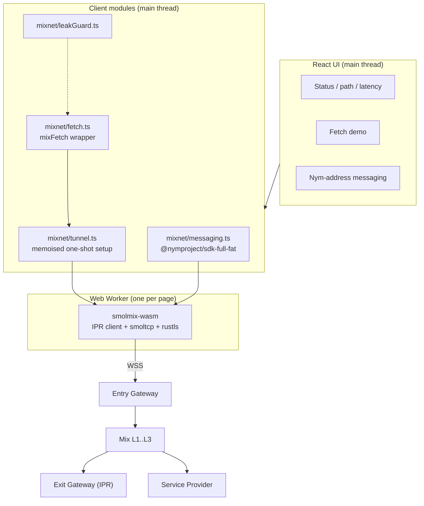

# 2. Browser & Mobile Client (Web, Android, Desktop)

> Section [1] of the original brief. The client must be **cross-platform** and
> **shippable on Android at least**. That constraint drives the whole design:
> we build a **PWA-first** web app that runs unmodified in a desktop browser,
> an Android browser, a Trusted Web Activity, or a Capacitor WebView.

---

## 2.1 What the client must do

1. Route HTTPS requests through the Nym mixnet via an Exit Gateway
   (`mixFetch`) — the "clearnet" mode.
2. Talk to **pure-mixnet services** by Nym address, with anonymous SURB replies
   (TypeScript SDK messaging).
3. Stream over `ws`/`wss` where needed (`MixWebSocket`).
4. Show status: tunnel state, hop count, pure-vs-exit, latency, leak-guard state.
5. Never silently fall back to the clearnet.

---

## 2.2 Cross-platform strategy

| Target | Technology | Can route | Notes |
|---|---|---|---|
| Desktop browser (Chrome/Firefox/Edge/Safari) | PWA + WASM worker | requests made by *your app* | Works today. |
| Android browser (Chrome/Firefox) | same PWA | requests made by *your app* | WASM + Web Workers + WSS all supported. |
| Android app store | **TWA / Bubblewrap** wrapping the PWA | same as PWA | Uses the user's Chrome; no WebView divergence. **Recommended Android packaging.** |
| Android native shell | **Capacitor** (Chromium WebView) | same as PWA | Use when you need native plugins: secure storage, foreground service, share intents. |
| Desktop extension | MV3 (Chrome/Firefox) | app pages + allow-listed hosts | **Not available on Android Chrome.** Bonus, not the Android path. |
| All apps on the device | **NymVPN** (dVPN) or local `nym-socks5-client` | entire OS | Out of scope for a browser client; documented as the honest alternative. |

> **The honest boundary.** A browser/WASM client can only route traffic that
> *goes through your code*. It cannot transparently proxy the whole browser or
> phone. For system-wide Android routing use NymVPN; for a desktop-specific
> SOCKS proxy use `nym-socks5-client` on `127.0.0.1:1080`.

### Why PWA-first wins for Android

Android Chrome/Firefox fully support the pieces `mix-tunnel` needs (WebAssembly,
Web Workers, `wss://`, IndexedDB). Packaging the same build three ways —
browser, Bubblewrap TWA, Capacitor APK — gives one codebase and no fork.

```
                 one TypeScript/React codebase
                            │
        ┌───────────────────┼────────────────────┐
        ▼                   ▼                    ▼
   Web / PWA          Bubblewrap TWA        Capacitor APK
 (desktop + Android  (Play Store, uses     (Chromium WebView,
  browsers)           system Chrome)        native plugins)
```

---

## 2.3 Architecture



Two independent Nym paths coexist:

* **`mixFetch` / `mixDNS` / `MixWebSocket`** — clearnet through an Exit Gateway.
* **`@nymproject/sdk` messaging** — direct Nym-address, pure mixnet, SURBs.

They share the same underlying WASM/worker machinery conceptually, but use
different packages; both are lazily imported.

---

## 2.4 Key modules and code

### Tunnel wrapper (`web/src/mixnet/tunnel.ts`)

The tunnel is **one-shot per page**: a second `setupMixTunnel` rejects, and
guarding on `getTunnelState()` races. Memoise a single promise so concurrent
callers await one bring-up, and clear it on failure so a retry is possible.

```ts
let tunnelPromise: Promise<unknown> | undefined;

export function ensureTunnel(opts?: SetupTunnelOpts) {
  tunnelPromise ??= import('@nymproject/mix-fetch')
    .then((m) => m.setupMixTunnel(opts))
    .catch((err) => { tunnelPromise = undefined; throw err; });
  return tunnelPromise;
}
```

### Clearnet fetch (`web/src/mixnet/fetch.ts`)

```ts
import { ensureTunnel } from './tunnel';

export async function mixnetFetch(input: RequestInfo, init?: RequestInit) {
  await ensureTunnel();
  const { mixFetch } = await import('@nymproject/mix-fetch');
  return mixFetch(input as string, init);
}
```

### Pure-mixnet messaging (`web/src/mixnet/messaging.ts`)

Uses the documented `@nymproject/sdk-full-fat` API. `sdk-full-fat` inlines the
WASM + worker as Base64, so **no bundler configuration is required** — which
matters for reproducible Android builds.

```ts
import { createNymMixnetClient } from '@nymproject/sdk-full-fat';

const nym = await createNymMixnetClient();
nym.events.subscribeToTextMessageReceivedEvent(async (e) => {
  if (e.args.senderTag) {
    await nym.client.replyWithSurb({
      senderTag: e.args.senderTag,
      payload: { message: 'pong', mimeType: 'text/plain' },
    });
  }
});
await nym.client.start({
  clientId: crypto.randomUUID(),
  nymApiUrl: 'https://validator.nymtech.net/api',
  forceTls: true, // WSS; required on HTTPS pages
});
await nym.client.send({
  payload: { message: 'hello', mimeType: 'text/plain' },
  recipient: '<identity>.<encryption>@<gateway>',
});
```

> The SDK persists client identity in **IndexedDB**. To force a fresh identity,
> clear the relevant IndexedDB databases (also the fix for a stuck gateway
> handshake).

### Leak guard (`web/src/mixnet/leakGuard.ts`)

Mixnet payload traffic never appears in `connect-src` as a connection to the
destination, so a direct `fetch` to a routed host is a bug. Wrap the globals and
fail closed in development.

```ts
export function installLeakGuard(routedHosts: Set<string>, failClosed: boolean) {
  const nativeFetch = window.fetch;
  window.fetch = function (input, init) {
    const url = input instanceof Request ? input.url : String(input);
    const host = new URL(url, location.href).hostname;
    if (routedHosts.has(host)) {
      console.error('nym leak guard: direct request to routed host', url);
      if (failClosed) throw new Error(`blocked direct request to ${url}`);
    }
    return nativeFetch.call(this, input, init);
  };
  // ...same for XMLHttpRequest.prototype.open
}
```

Known blind spots (documented, not fixable in JS): cross-origin iframes, vendor
SDKs in their own contexts, `navigator.sendBeacon`, `EventSource`, ``/`<script>`
sources, and third-party `WebSocket`s. Drop those integrations or proxy them.

### Content Security Policy

```
default-src 'self';
script-src 'self' 'wasm-unsafe-eval';          /* REQUIRED for WebAssembly */
worker-src 'self' blob:;                       /* mix-tunnel starts its worker from an object URL */
connect-src 'self' wss: https://validator.nymtech.net;
img-src 'self' data:;
```

* **`script-src` must include `'wasm-unsafe-eval'`.** The Nym client compiles
  WebAssembly. Under a bare `script-src 'self'`, Chrome and Firefox refuse
  `WebAssembly.compile()` and the mix-tunnel worker throws `CompileError`; the
  UI then hangs at "bringing up mixnet tunnel" with no visible error. Use
  `'wasm-unsafe-eval'` (WASM compile only), **not** `'unsafe-eval'`.
* `wss:` must stay broad — gateway hostnames come from the topology at runtime
  (e.g. `wss://<node-host>:<port>/`).
* `https://validator.nymtech.net` is the plain-HTTPS bootstrap; leave it out and
  the tunnel fails at startup with an unrelated-looking gateway error.
* The "prove tunnel" demo (clearnet vs mixnet source-IP comparison) makes a
  **clearnet** fetch, which *is* subject to `connect-src` — its echo host
  (`https://api.ipify.org`) must be listed, or the proof fails with
  `TypeError: Failed to fetch` before either IP is shown. The mixnet side of the
  comparison is not affected: it travels over the gateway WSS.
* `worker-src 'self' blob:` is mandatory; without it the worker is blocked.
* Check for a server-set policy too: multiple policies intersect and the
  narrower one wins. A server-sent `script-src` must also carry
  `'wasm-unsafe-eval'`.
* `frame-ancestors` and a few other directives are **ignored in a `<meta>` CSP**
  — they must be sent as an HTTP header. The desktop launcher sends
  `X-Frame-Options: DENY` for this reason.

---

## 2.5 Android packaging

### Option A — Trusted Web Activity (recommended)

Bubblewrap wraps the deployed PWA in an APK that renders in the user's Chrome.
No WebView version drift, and the PWA/service-worker model keeps working.

```bash
npm install -g @bubblewrap/cli
bubblewrap init --manifest https://your.app/manifest.webmanifest
bubblewrap build            # produces app-release-signed.apk / .aab
```

Requirements: your PWA is served over **HTTPS** with a valid certificate and a
correct `manifest.webmanifest` (`display: standalone`, icons, `start_url`), plus
**Digital Asset Links** (`/.well-known/assetlinks.json`) so the TWA opens
without a URL bar.

### Option B — Capacitor (native shell)

Use when you need plugins (secure storage, foreground service, share).

```bash
npm i @capacitor/core @capacitor/android
npm i -D @capacitor/cli
npx cap init "nysiris" app.example.nysiris --web-dir=dist
npm run build && npx cap add android && npx cap sync
```

`capacitor.config.ts`:

```ts
import type { CapacitorConfig } from '@capacitor/cli';

const config: CapacitorConfig = {
  appId: 'app.example.nysiris',
  appName: 'nysiris',
  webDir: 'dist',
  android: {
    allowMixedContent: false,          // never allow cleartext
    webContentsDebuggingEnabled: false // true only in dev
  },
  server: { androidScheme: 'https' },
};

export default config;
```

### Android manifest essentials

```xml
<uses-permission android:name="android.permission.INTERNET" />
<!-- Only if you add a long-lived tunnel as a foreground service: -->
<!-- <uses-permission android:name="android.permission.FOREGROUND_SERVICE" /> -->

<application
    android:usesCleartextTraffic="false"
    android:networkSecurityConfig="@xml/network_security_config">
    <activity
        android:name=".MainActivity"
        android:exported="true"
        android:configChanges="orientation|keyboardHidden|screenSize">
        <intent-filter>
            <action android:name="android.intent.action.MAIN" />
            <category android:name="android.intent.category.LAUNCHER" />
        </intent-filter>
    </activity>
</application>
```

`android/app/src/main/res/xml/network_security_config.xml`:

```xml
<network-security-config>
    <base-config cleartextTrafficPermitted="false" />
</network-security-config>
```

This is important: it guarantees that even if the app accidentally issues a
plaintext request, Android refuses it.

### Capacitor WebView settings (`MainActivity`)

Chromium WebView supports WASM, Web Workers and `wss://`. Keep defaults tight:

```kotlin
// android/app/src/main/java/.../MainActivity.kt
class MainActivity : BridgeActivity() {
    override fun onCreate(savedInstanceState: Bundle?) {
        super.onCreate(savedInstanceState)
        // Capacitor already enables JavaScript + DOM storage.
        // Do NOT enable file access, universal access from file URLs,
        // or mixed content — all are SSRF/leak risks for a mixnet client.
    }
}
```

### Android runtime realities (plan for these)

* **Background limits.** Android aggressively stops background work; Doze and
  App Standby will suspend a long-lived tunnel. If you need a persistent
  connection, run it in a **foreground service** with a visible notification,
  otherwise treat the tunnel as foreground-only and reconnect on resume.
* **One-shot tunnel.** The WASM tunnel cannot be rebuilt without a page reload.
  On Capacitor, a full page reload is a `webView.reload()`; on PWA it is
  `location.reload()`. Surface a clear "reconnect" action instead of silently
  trying a second `setupMixTunnel`.
* **Battery/data.** Cover traffic runs continuously while connected; show the
  user a data estimate and offer disconnect. Consider `disableCoverTraffic` only
  if the user explicitly accepts the privacy trade-off.
* **Secure storage.** The messaging SDK stores identity in IndexedDB, which is
  app-scoped but not hardware-backed. For higher assurance, generate/import keys
  and wrap them with Android Keystore / `EncryptedSharedPreferences` via a
  Capacitor plugin, and document the threat model.
* **App Links.** Use verified App Links if services hand off to your app.
* **Network changes.** Handle Wi-Fi↔cellular transitions as a reconnect; the WSS
  to the entry gateway will drop.

### Desktop extension (bonus, not Android)

`extension/` provides a minimal MV3 scaffold. Chrome for Android does not
support extensions, so this is a desktop convenience only. The extension cannot
transparently proxy all tabs either; it routes requests it controls and can
redirect allow-listed hosts into a mixnet-aware page/worker.

---

## 2.6 Performance expectations

* **Latency.** Mixnet mode adds per-hop mixing delays (tens of ms) plus 5 hops
  and exit processing; expect **hundreds of milliseconds to a few seconds** per
  request, far above clearnet. Design UIs to be async and cancellable.
* **Throughput.** Fixed 2413-byte packets with a ~50 packet/s budget means
  mixnet mode is for request/response, not bulk transfer. A large fetch
  fragments and is metered one interval apart, so it can take seconds.
* **First connect.** Several seconds (topology fetch + gateway handshake +
  WASM boot).
* **Bundle.** The worker/WASM chunk is multiple MB; lazy-load it and never block
  first paint.

---

## 2.7 Module map

| File | Responsibility |
|---|---|
| `web/src/adapters/driving/shell/App.tsx` | View switching (Home / Messages / Portal / Settings), URI-bar binding, panel composition |
| `web/src/application/views.ts` | Primary-view registry + persisted active view / Advanced visibility / onboarding flag |
| `web/src/adapters/driving/shell/AppNav.tsx` | Primary navigation + discreet protection pill |
| `web/src/adapters/driving/shared/StatusPill.tsx` | Protected / Connecting… / Not protected / Something-went-wrong pill with friendly details |
| `web/src/adapters/driving/shell/Onboarding.tsx` | Welcome → Connect privately → success first-run flow |
| `web/src/adapters/driving/shared/FriendlyError.tsx` | Human-readable error banner (Try again + Copy error + collapsed technical details) |
| `web/src/adapters/driving/shared/ShareCard.tsx` | Petname-first label, Copy link, local QR, Show-technical-details toggle |
| `web/src/shared/share.ts` | Short labels, private-link building, petname lookup, clipboard helper |
| `web/src/shared/friendlyErrors.ts` | Raw-error → calm headline/help/action mapping |
| `web/src/adapters/driving/shared/theme.css` | Calm light/dark responsive theme (PWA / desktop / Android) |
| `web/src/application/panels.ts` | Technical-panel registry + persisted open-state (Settings → Advanced) |
| `web/src/adapters/driving/shell/Toolbar.tsx` | Advanced window menu + technical connection pill |
| `web/src/adapters/driving/shared/Panel.tsx` | Panel window chrome (close hides, never stops work) |
| `web/src/mixnet/tunnel.ts` | Memoised one-shot tunnel bring-up/teardown, state, privacy guardrail |
| `web/src/mixnet/fetch.ts` | `mixFetch` wrapper, source-IP proof, exit-rotation tracking |
| `web/src/mixnet/messaging.ts` | `@nymproject/sdk-full-fat` send / SURB reply (deduped, rate-limited) |
| `web/src/mixnet/enforcement.mjs` | Reply dedupe/TTL, reply budget, privacy guardrail, exit policy |
| `web/src/mixnet/routedHosts.mjs` | Pure leak-guard decisions |
| `web/src/mixnet/leakGuard.ts` | Direct-request detection, fail-closed |
| `web/src/mixnet/status.ts` | Derive UI status from tunnel state |
| `web/src/adapters/driving/shell/App.tsx` | React UI |
| `web/capacitor.config.ts` | Capacitor/Android config |
| `android/` | Manifest, network security config, release notes |
| `extension/` | MV3 desktop scaffold |

Runtime enforcement mirrors `crates/sphinx-core/src/enforcement.rs`; the
control-to-test map is in [`05-security.md`](05-security.md) §5.10. Run the web
unit tests with `node --test web/test/*.test.mjs` or `./build.sh check`.

### Browser ↔ Rust provider messaging (resolved)

The browser `@nymproject/sdk-full-fat` client and the Rust SDK use different
wire shapes: the TS SDK wraps payloads in a mime envelope, while Rust
`send_plain_message` / `send_reply` use raw bytes. To interoperate:

* **send raw** — `client.rawSend({ payload: new TextEncoder().encode(msg), recipient })`
  so the Rust provider receives clean UTF-8 (not the TS envelope, which the
  provider would echo as binary noise);
* **receive raw** — `events.subscribeToRawMessageReceivedEvent((e) => …)`,
  decoding `e.args.payload` (a `Uint8Array`) with `TextDecoder`.

Verified end to end: the browser sent `"hello from the browser"`, the Rust
provider logged `received 22 bytes` and `replied via SURB (28 bytes)`, and the
browser Inbox showed `echo: hello from the browser`.

Notes for this SDK build (1.4.1):

* It has no `senderTag`/`replyWithSurb`, so **browser-side anonymous SURB
  replies are unavailable** — the browser can send and receive, but not reply
  anonymously. Use the Rust SDK for that direction.
* Subscribe to events **after** `start()`, and poll `selfAddress()` (it is
  briefly empty while the gateway handshake completes).
* The SDK logs a harmless `Failed to parse binary message` for each raw message
  (it still tries the mime path) and a transient `Client has not been
  initialised` line during startup; neither affects the raw path.

Build and run are in `web/README.md`. Continue to
[`05-security.md`](05-security.md) for the threat model and hardening.
