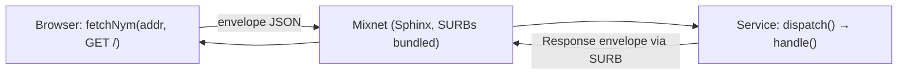

# 8. Hidden-Service Abstraction

> Nym ships no Tor-style `.onion` stack. This section defines hidden-service
> semantics as a thin layer over the messaging shape the SDKs already speak —
> implemented in `crates/nym-hidden-service/` (Rust) and
> `web/src/mixnet/fetchNym.ts` (browser, `fetchNym()` + base64 helpers).

---

## 8.1 What "hidden service" means here

A process with an embedded Nym client that **dials out** (WSS) to a gateway and
is reachable **only** by its Nym address. No listener, no inbound ports, no
DNS. Replies travel back exclusively via the client's SURBs, so the service
never learns who asked. That is the whole primitive; everything below is
ergonomics around it.

## 8.2 The three pieces

| Piece | Rust | Browser |
|---|---|---|
| **Address** | `NymUri`: `nym://<id>.<enc>@<gw>` (bare `id.enc@gw` parses too) | `parseNymAddress()` |
| **Envelopes** | `Request`/`Response`: `{method, path, headers, body_base64}` ↔ `{status, headers, body_base64, error}` | `encodeRequest()` / `decodeResponse()` |
| **Server** | `HiddenService` trait + `dispatch()` harness | — (browser is client-only) |
| **Client** | any `send` + SURB reply | `fetchNym(address, {method, path, headers, body})` |
| **Names** | `PetnameRegistry` (local JSON file) | `resolvePetname(input, registry)` |
| **Large bodies** | `chunk::split` / `join` | one envelope per chunk, sequential |



## 8.3 Server: implement the trait, keep your transport loop

```rust
use nym_hidden_service::{HiddenService, Request, Response};

struct Shop;
impl HiddenService for Shop {
    fn handle(&self, req: &Request) -> Response {
        match (req.method.as_str(), req.path.as_str()) {
            ("GET", "/") => Response::ok(200, "text/html", b"<h1>shop</h1>"),
            _ => Response::error(404, "unknown route"),
        }
    }
}

// in your message loop:
let reply_bytes = nym_hidden_service::dispatch(&Shop, &msg.message);
client.send_reply(sender_tag, reply_bytes).await?;
```

`dispatch` parses, re-validates through `bridge-guard`, calls `handle`, and
serializes. Malformed input becomes a 400/502 `Response`, never a panic. Your
loop still owns SURBs, budgets, and disconnects.

## 8.4 Client: one call, one response

```ts
import { fetchNym } from './mixnet/fetchNym';

const res = await fetchNym('nym://<id>.<enc>@<gw>', { method: 'GET', path: '/' });
// res.status, res.headers, res.body (Uint8Array), res.error
new TextDecoder().decode(res.body); // page text
```

The UI exposes this as **Hidden service fetch (nym://)** — address plus path,
no `Connect` needed (that path is for clearnet-via-exit, a different mode).

### The top URI bar

The app header is an omnibox for hidden services: paste
`nym://<id>.<enc>@<gw>/path` — or a bare `id.enc@gw/path`, or just the bare
address (path defaults to `/`) — and press Enter or **Go**. `splitNymUri()`
separates address from path and validates both before anything touches the
network; garbage yields a log error, never a send.

HTML replies render in a **sandboxed** iframe (`sandbox=""`: no scripts, no
forms, opaque origin). Service HTML is displayed, never executed. Any other
content type shows as text.

### Why actions live in the browser, not in the page

Post, follow, DM, and sign buttons cannot live inside a fetched body: the
sandbox that makes fetching untrusted services safe also disables scripts, and
enabling them would let service HTML exfiltrate over clearnet past the mixnet.
So the architecture is inverted from the classic web — **the browser is the
application, the service is data**:

* the URI bar navigates (fetch + render content);
* navigating to a service **binds the Social client to its address**, so the
  timeline, composer, profile editor, and DMs below operate on what you just
  fetched — no address paste needed twice;
* keys never leave the browser: signing happens in `web/src/domain/`, the
  service only ever sees signatures it verifies.

Constraint: requests are **one at a time per client** — the bridge answers each
request with one SURB reply, and SDK 1.4.1 exposes no sender tags to correlate
concurrent calls. Serialize `fetchNym` calls.

## 8.5 Names without a directory

There is deliberately **no global lookup** — enumerable clients destroy
first-contact unlinkability (`05-security.md` §5.7). Human names live only in
the client's own registry:

```rust
let mut reg = PetnameRegistry::new();
reg.insert("shop", "nym://<id>.<enc>@<gw>".parse()?)?;
reg.save(Path::new("petnames.json"))?;
let uri = reg.resolve("shop")?;          // or a raw address string
```

Ship addresses in client config, QR codes, or signed releases. ENS is the only
third-party option we bless, and only as a pointer *to* an address, never as a
replacement for it.

## 8.6 Bodies larger than one packet

One message carries ~2 KB of plaintext. For larger bodies, split with
`chunk::split(data, 2000)`, send one envelope per chunk (e.g. `?part=i/n` on
the path), and `chunk::join` on receipt with explicit, authenticated framing.
Bulk transfer remains the weakest workload for anonymity (`05-security.md`
§5.2) — chunk only what must be bigger than a packet.

## 8.7 What this is not

* Not a directory, DHT, or discovery protocol — by design.
* Not Tor introduction/rendezvous — Nym needs none, since clients send directly
  to the provider's gateway through the mix.
* Not streaming — request/response messaging only.
* Not anonymous replies *from* the browser — SDK 1.4.1 lacks `senderTag` /
  `replyWithSurb`; use the Rust SDK for that direction (`03-browser-client.md`).

## 8.8 Files

| Path | Purpose |
|---|---|
| `crates/nym-hidden-service/` | `uri`, `envelope`, `service` (+ `dispatch`), `petnames`, `chunk`; 7 tests |
| `web/src/mixnet/hiddenService.mjs` | pure envelope/address/petname helpers; 6 tests |
| `web/src/mixnet/fetchNym.ts` | `fetchNym()`, base64 bytes helpers |
| `web/src/adapters/driving/shell/App.tsx` | omnibox, toolbar, portal main view (page iframe + Social), panel composition |
| `web/src/application/panels.ts` | panel registry + persisted open-state (5 tests) |
| `web/src/adapters/driving/shell/Toolbar.tsx` | window menu + always-visible connection pill |
| `web/src/adapters/driving/shared/Panel.tsx` | panel window chrome (title bar + close; closing hides, never stops work) |
